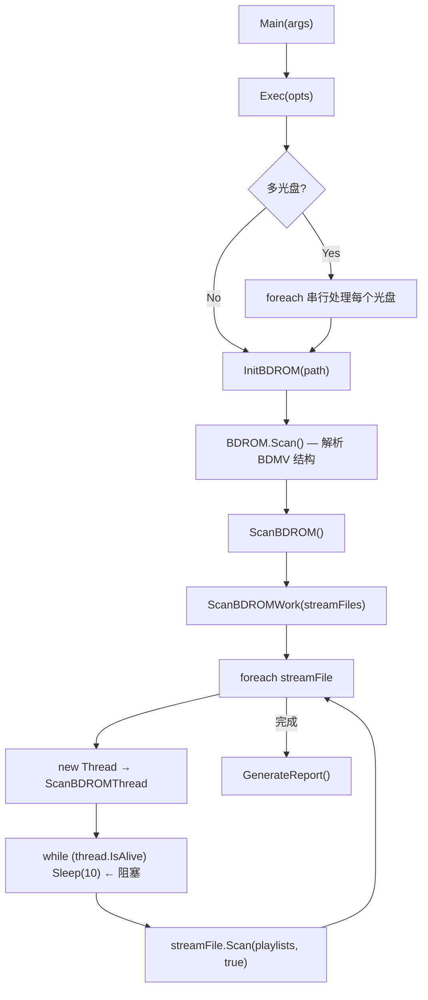

# BDInfo 多核并行扫盘重构 — 产品需求文档 (PRD)

## 1. 背景与动机

[BDInfo](https://github.com/dotnetcorecorner/BDInfo) 是一个用于扫描蓝光光盘（Full HD / Ultra HD / 3D）信息的 .NET 命令行工具。它可以解析 ISO / BDMV 文件夹，输出包含播放列表、码率、音视频编码等详细信息的扫盘报告。

### 现状痛点

经过对源码的深入分析，**当前 BDInfo 的所有扫描工作都在单核/单线程上串行执行**：

```csharp
// Program.cs — ScanBDROMWork()
foreach (TSStreamFile streamFile in streamFiles)
{
    Thread thread = new(ScanBDROMThread);
    thread.Start(scanState);
    while (thread.IsAlive)          // ← 阻塞等待，一次只扫一个文件
    {
        Thread.Sleep(10);
    }
}
```

| 问题 | 详情 |
|------|------|
| **Stream 文件串行扫描** | `foreach` 逐个处理，`while (thread.IsAlive)` 阻塞等待 |
| **多光盘串行处理** | 多个 BDMV / ISO 也是 `foreach` 串行遍历 |
| **共享可变状态** | `ScanBDROMState` 单实例在所有扫描间共享（`StreamFile`、`Exception` 等字段直接被覆盖） |
| **无并发度控制** | 没有使用 `Parallel.ForEach`、`Task`、线程池或信号量 |

对于典型的 UHD 蓝光盘（50–100 GB），扫盘耗时完全受限于单核 CPU + 磁盘 I/O，在批量处理场景下尤为低效。

---

## 2. 目标

> **核心目标：重构 BDInfo 扫盘流程，支持多核并行扫描，显著缩短扫盘耗时。**

### 2.1 功能目标

| # | 目标 | 优先级 |
|---|------|--------|
| F1 | **Stream 文件级并行扫描** — 同一光盘内多个 `.m2ts` stream 文件可同时扫描 | P0 |
| F2 | **多光盘级并行扫描** — 多个 BDMV / ISO 可同时初始化和扫描 | P1 |
| F3 | **可配置并发度** — 新增 `-t / --threads` 参数控制最大并行线程数，默认 `Environment.ProcessorCount` | P0 |
| F4 | **线程安全的进度报告** — 并行扫描时进度条仍能正确显示总进度 | P0 |
| F5 | **报告输出正确性** — 并行扫描后的报告内容与串行版本完全一致（格式、数据无差异） | P0 |

### 2.2 非功能目标

| # | 目标 | 指标 |
|---|------|------|
| NF1 | **性能提升** | 在 ≥4 核机器上，扫盘速度提升 ≥2x（CPU-bound 场景） |
| NF2 | **向后兼容** | 所有现有命令行参数保持不变，`-t 1` 退化为串行行为 |
| NF3 | **内存安全** | 并行扫描不引入内存泄漏或显著增加峰值内存 |
| NF4 | **错误处理** | 单个文件扫描失败不影响其他文件的并行扫描 |

---

## 3. 现有架构分析

### 3.1 项目结构

```
BDInfo.Core/
├── BDCommon/                      # 共享库
│   ├── rom/
│   │   ├── BDROM.cs               # 蓝光光盘数据模型（Scan、PlaylistFiles、StreamFiles）
│   │   ├── TSStreamFile.cs        # Stream 文件 → Scan(playlists, true)
│   │   ├── TSPlaylistFile.cs      # 播放列表解析
│   │   ├── TSStreamClip.cs        # Stream clip 模型
│   │   ├── TSStreamClipFile.cs    # Clip 文件模型
│   │   ├── TSStreamBuffer.cs      # 缓冲区
│   │   ├── TSStream.cs            # 流基类（Video/Audio/Graphics/Text）
│   │   ├── TSCodec*.cs            # 各编码解析器 (AVC, HEVC, AC3, DTS, TrueHD, ...)
│   │   ├── TSInterleavedFile.cs   # SSIF 交错文件
│   │   ├── BDInfoSettings.cs      # 设置接口
│   │   ├── LanguageCodes.cs       # 语言代码映射
│   │   └── IO/                    # I/O 工具
│   ├── ScanBDROMState.cs          # 扫描状态（共享可变，单实例）
│   ├── ScanBDROMResult.cs         # 扫描结果
│   ├── ToolBox.cs                 # 工具函数
│   └── Cloner.cs                  # 深拷贝
├── BDInfo/                        # 主程序（命令行入口）
│   ├── Program.cs                 # Main → Exec → InitBDROM → ScanBDROM → GenerateReport
│   ├── BDSettings.cs              # 命令行设置实现
│   └── CmdOptions.cs              # 命令行参数定义
├── BDExtractor/                   # ISO 提取工具
├── BDInfoDataSubstractor/         # 数据提取器
└── BDInfo.Core.sln
```

### 3.2 扫描流程



### 3.3 关键痛点代码

#### 1) 单线程串行扫描 — `Program.cs` `ScanBDROMWork()`

```csharp
foreach (TSStreamFile streamFile in streamFiles)
{
    scanState.StreamFile = streamFile;       // ← 共享状态直接覆盖
    Thread thread = new(ScanBDROMThread);
    thread.Start(scanState);
    while (thread.IsAlive)                   // ← 阻塞等待
    {
        Thread.Sleep(10);
    }
    scanState.FinishedBytes += streamFile.FileInfo.Length;
    if (scanState.Exception != null)         // ← 异常也是共享字段
    {
        ScanResult.FileExceptions[streamFile.Name] = scanState.Exception;
    }
}
```

#### 2) 共享可变状态 — `ScanBDROMState.cs`

```csharp
public class ScanBDROMState
{
    public long TotalBytes { ... }
    public long FinishedBytes { ... }
    public TSStreamFile StreamFile = null;        // ← 非线程安全
    public Dictionary<string, List<TSPlaylistFile>> PlaylistMap = ...;
    public Exception Exception = null;            // ← 非线程安全
}
```

#### 3) 串行多光盘 — `Program.cs` `Exec()`

```csharp
foreach (var subDir in subItems.OrderBy(s => s))
{
    InitBDROM(opts.Path);  // 串行
    ScanBDROM();           // 串行
}
```

---

## 4. 重构方案

### 4.1 Phase 1：Stream 文件级并行（P0）

> 将 `ScanBDROMWork()` 从串行 `foreach` 改为 `Parallel.ForEach` 或 `Task` 并行。

#### 关键改动

| 改动点 | 现状 | 目标 |
|--------|------|------|
| `ScanBDROMWork()` | `foreach` + 单线程 | `Parallel.ForEach` + `MaxDegreeOfParallelism` |
| `ScanBDROMState` | 单实例共享 | 拆分为不可变的全局状态 + 每线程局部状态 |
| `StreamFile` 字段 | 共享可变 | 移入 `ParallelLoopState` 或局部变量 |
| `Exception` 字段 | 共享覆盖 | 使用 `ConcurrentDictionary<string, Exception>` 收集 |
| `FinishedBytes` | 非线程安全的 `+=` | 使用 `Interlocked.Add` |
| 进度报告 | 依赖 `scanState.StreamFile` | 使用线程安全的进度聚合器 |

#### 伪代码

```csharp
private static void ScanBDROMWork(List<TSStreamFile> streamFiles)
{
    var scanState = new ScanBDROMState();
    // ... 初始化 TotalBytes 和 PlaylistMap（只读，不需要线程安全）...

    var fileExceptions = new ConcurrentDictionary<string, Exception>();
    long finishedBytes = 0;

    var options = new ParallelOptions
    {
        MaxDegreeOfParallelism = _bdinfoSettings.MaxThreads  // 新参数
    };

    Parallel.ForEach(streamFiles, options, streamFile =>
    {
        try
        {
            List<TSPlaylistFile> playlists = scanState.PlaylistMap[streamFile.Name];
            streamFile.Scan(playlists, true);
        }
        catch (Exception ex)
        {
            fileExceptions[streamFile.Name] = ex;
        }
        finally
        {
            Interlocked.Add(ref finishedBytes, streamFile.FileInfo.Length);
        }
    });

    // 汇总结果
    ScanResult.ScanException = null;
    foreach (var kv in fileExceptions)
        ScanResult.FileExceptions[kv.Key] = kv.Value;
}
```

### 4.2 Phase 2：多光盘级并行（P1）

> 当输入路径包含多个 BDMV / ISO 时，并行处理独立的光盘。

#### 关键改动

```csharp
// 现状: 串行
foreach (var subDir in subItems.OrderBy(s => s))
{
    InitBDROM(opts.Path);
    ScanBDROM();
}

// 目标: 并行（每个光盘独立的 BDROM 和 ScanResult 实例）
Parallel.ForEach(subItems.OrderBy(s => s), options, subDir =>
{
    var bdrom = new BDROM(subDir, _bdinfoSettings);
    bdrom.Scan();
    var result = ScanBDROMParallel(bdrom);
    // 线程安全地收集报告
});
```

> [!IMPORTANT]
> 此阶段需要将 `BDROM` 和 `ScanResult` 的**静态字段改为实例字段**，消除全局状态依赖。

### 4.3 Phase 3：线程安全的进度报告

#### 设计

```csharp
public class ThreadSafeProgressReporter
{
    private long _totalBytes;
    private long _finishedBytes;
    private readonly ConcurrentDictionary<int, string> _activeFiles = new();

    public void ReportProgress(int threadId, string fileName, long fileBytes)
    {
        _activeFiles[threadId] = fileName;
        Interlocked.Add(ref _finishedBytes, fileBytes);
        RenderProgress();
    }

    private void RenderProgress()
    {
        double progress = (double)_finishedBytes / _totalBytes;
        // 使用 \r 覆盖输出行
        Console.Write($"\rScanning [{_activeFiles.Count} active] | Progress: {100*progress:F2}% ...");
    }
}
```

### 4.4 新增命令行参数

| 参数 | 长参数 | 含义 | 默认值 |
|------|--------|------|--------|
| `-t` | `--threads` | 最大并行线程数 | `Environment.ProcessorCount` |

当 `-t 1` 时退化为串行行为，保持完全向后兼容。

---

## 5. 需要验证的线程安全问题

在并行化之前，需要审计以下关键类的线程安全性：

| 类 | 风险点 | 策略 |
|----|--------|------|
| `TSStreamFile.Scan()` | 每个实例独立调用，互不共享 → ✅ 天然安全 | 无需改动 |
| `TSPlaylistFile.ClearBitrates()` | 在准备阶段串行调用 → 需确保不在并行阶段被调用 | 移至准备阶段完成 |
| `TSPlaylistFile` 的 bitrate 累加 | 多个 stream 扫描结果写回同一 playlist | 需加锁或使用 `Interlocked` |
| `TSStreamClip` 属性写入 | `PacketSize`、`BitRate` 等被 stream scan 写入 | 审计是否有跨 stream 共享 |
| `BDROM` 实例 | 扫描阶段只读 → ✅ 安全 | 无需改动 |
| 报告生成 | 在扫描完成后串行执行 → ✅ 安全 | 无需改动 |

> [!CAUTION]
> **最关键的风险点**：`streamFile.Scan(playlists, true)` 内部会将解析结果写入关联的 `TSPlaylistFile` 和 `TSStreamClip` 对象。如果多个 stream 文件映射到同一个 playlist，并行写入可能导致数据竞争。必须深入审计 `TSStreamFile.Scan()` 的内部实现来确认。

---

## 6. 改动文件清单

| 文件 | 改动类型 | 说明 |
|------|----------|------|
| `BDInfo/CmdOptions.cs` | 修改 | 新增 `-t / --threads` 参数 |
| `BDInfo/BDSettings.cs` | 修改 | 新增 `MaxThreads` 属性 |
| `BDCommon/rom/BDInfoSettings.cs` | 修改 | 新增 `MaxThreads` 接口属性 |
| `BDInfo/Program.cs` | **重构** | 并行化 `ScanBDROMWork()`、`Exec()` 多光盘处理、消除静态可变字段 |
| `BDCommon/ScanBDROMState.cs` | **重构** | 拆分为线程安全的全局状态 + 局部状态 |
| `BDCommon/ScanBDROMResult.cs` | 修改 | `FileExceptions` 改为 `ConcurrentDictionary` |
| `BDInfo/Program.cs` (进度) | 修改 | 新增 `ThreadSafeProgressReporter` |

---

## 7. 风险与缓解

| 风险 | 影响 | 缓解 |
|------|------|------|
| playlist 共享写入导致的数据竞争 | 报告数据错误 | 深入审计后选择加锁 / clone 策略 |
| ISO 虚拟文件系统的并发读取 | DiscUtils 可能不支持并发读 | 对 ISO 场景退化为串行或加读锁 |
| 内存占用翻倍 | OOM（大盘 + 多线程） | 单盘内并发度限制 + 内存监控 |
| 进度报告闪烁 | 用户体验差 | 限制输出频率（如 500ms 一次） |

---

## 8. 验证计划

| # | 验证项 | 方法 |
|---|--------|------|
| V1 | 报告正确性 | 同一光盘分别以 `-t 1`（串行）和 `-t N`（并行）扫描，`diff` 比较报告输出 |
| V2 | 性能提升 | 在 ≥4 核机器上用 UHD 盘测试，对比扫描耗时 |
| V3 | 线程安全 | 使用 ThreadSanitizer 或压力测试（极端并发度）检测数据竞争 |
| V4 | 错误隔离 | 人工构造一个损坏的 stream 文件，验证不影响其他文件扫描 |
| V5 | 向后兼容 | 不带 `-t` 参数运行，验证默认行为正确 |
| V6 | 内存安全 | 并行扫描大盘时监控峰值内存，与串行版本对比 |

---

## 9. 里程碑

| 阶段 | 内容 | 预估工期 |
|------|------|----------|
| M1 | 审计 `TSStreamFile.Scan()` 线程安全性，确认并行化可行性 | 1–2 天 |
| M2 | Phase 1 — Stream 文件级并行 + 线程安全进度 + `-t` 参数 | 3–5 天 |
| M3 | 验证 V1–V6 | 1–2 天 |
| M4 | Phase 2 — 多光盘级并行（可选） | 2–3 天 |
| M5 | 性能调优、文档更新、PR 提交 | 1 天 |

---

## 10. 超出范围 (Out of Scope)

- 异步 I/O (`async/await`) 改造 — 当前瓶颈主要是 CPU 解析，非 I/O wait
- GUI 版本适配
- BDExtractor / BDInfoDataSubstractor 的并行化
- .NET 版本升级
